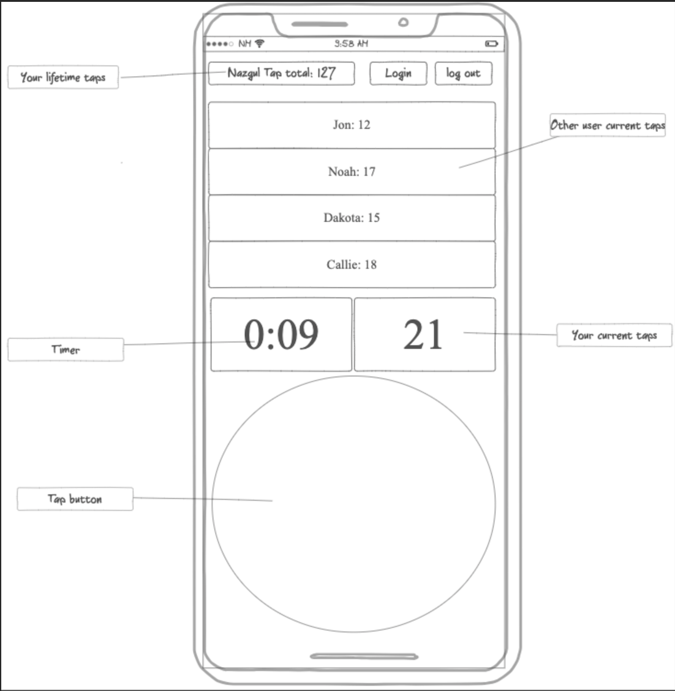

# startup

Notes: https://github.com/NewPhyrexia/startup/blob/main/notes.md

# Tapper

## Description deliverable

### Elevator pitch

Have you ever needed to prove yourself to someone, or needed to best a rival in a non-physical bout of skill and endurance. The Tapper application makes it so people can good head to head by pulling out their phones and face off in a battle of speed. Each user taps their screen as fast as possible as the timer counts down. The players will see all other player's tap scores in realtime. After the time is out and the smoke settles the victor is declared.  

### Design

### Key features

- Secure login over HTTPS
- Ability to enter group to play
- Display scores while game is both in realtime and ended
- Ability to select rematch
- Total taps are persistently stored
- Ability for user to create group to tap battle

### Technologies

I am going to use the required technologies in the following ways.

- **HTML** - Uses correct HTML structure for application. Two HTML pages. One for login and one end game scores.
- **CSS** - Application styling that looks good on different screen sizes, uses good whitespace, color choice and contrast.
- **JavaScript** - Provides login, tap counting, group creation, display other users tap score.
- **Service** - Backend service with endpoints for:
  - login
  - retrieving group choice
  - send tap count of user
  - retrieving tap status
- **DB** - Store users, and user total taps in database.
- **Login** - Register and login users. Credentials securely stored in database. Can't play unless authenticated.
- **WebSocket** - As each user taps their screen, their tap count is broadcasted to all other users.
- **React** - Application ported to use the React web framework.
## HTML deliverable

For this deliverable I built out the structure of my application using HTML.

- **HTML pages** - Two HTML page that represent the ability to login and play.
- **Links** - The login page automatically links to the play page. The play page contains links to play again and join a room.
- **Text** - Each of the player names, timer, and scores are represented by text.
- **Images** - This application does not use images
- **3rd Party service calls** - Currenlty I do not believe this app will use these.
- **Login** - Input box and submit button for login.
- **Database** - The lifetime score represents data pulled from the database.
- **WebSocket** - The current score or players represent the scores of realtime players in the room.

## CSS deliverable

For this deliverable I properly styled the application into its final appearance.

- **Header, footer, and main content body** - I mad these uniform throughout if at all possible.
- **Navigation elements** - Are positioned and colored ways to make them noticable.
- **Responsive to window resizing** - My app streches and shrinks to match many sizes of screens
- **Application elements** - Used good contrast of darker colors
- **Application text content** - Consistent fonts
- **Application images** - Still don't have images and so no styling here.

## JavaScript deliverable

For this deliverable I implemented by JavaScript so that the application works for a single user. I also added placeholders for future technology.

- **login** - When you press enter or the login button it takes you to the tapbattle page.
- **database** - Upon login a player object is created with a name and lifetimeHighScore. When the player beats their high score the lifetimeHighScore variable in the player object is updated.
- **WebSocket** - I caused the other player's scores to populate after the timer ends. This will be replaced with WebSocket messages later.
- **application logic** - A time begins when the tap button is pressed for the first time. As teh timer is running the score counter increases on every click. If the score beats the highscore the highscore will reflect the new highscore.

## Service deliverable

For this deliverable I added endpoints that allowed the user's score to update and be stored in the backend.

- **Node.js/Express HTTP service** - done
- **Static middleware for frontend** - done
- **Calls to third party endpoints** - Karma is shown with a random emoji that fetches from a github repo api.
- **Backend service endpoints** - A highscore is stored in a DB placeholder that is checked by a GET upon page bootup. The same highscore is then updated by a Post if the highscore is beat during the game.
- **Frontend calls service endpoints** - The Highscore fetches from the temp database highscore on the back end.

## DB deliverable

For this deliverable I stored the user's plaer info in the database.

- **MongoDB Atlas database created** - done
- **Endpoints for data** - My stubbed out endpoints now process the data and send it to Mongo.
- **Stores data in MongoDB** - store the player objects that are created at login.

## Login deliverable

For this deliverable I associate the highscore with the logged in user.

- **User registration** - Creates a new account in the database.
- **existing user** - Stores the highscore under the same user if the user already exists.
- **Use MongoDB to store credentials** - Stores both user and their highscore.
- **Restricts functionality** - You cannot play until you have logged in. This is restricted on the frontend.

## WebSocket deliverable

For this deliverable I used webSocket to update the player scores in the middle of the app on the frontend in realtime.

- **Backend listens for WebSocket connection** - done
- **Frontend makes WebSocket connection** - done
- **Data sent over WebSocket connection** - done
- **WebSocket data displayed** - All user's latest scror display in realtime to other users.
